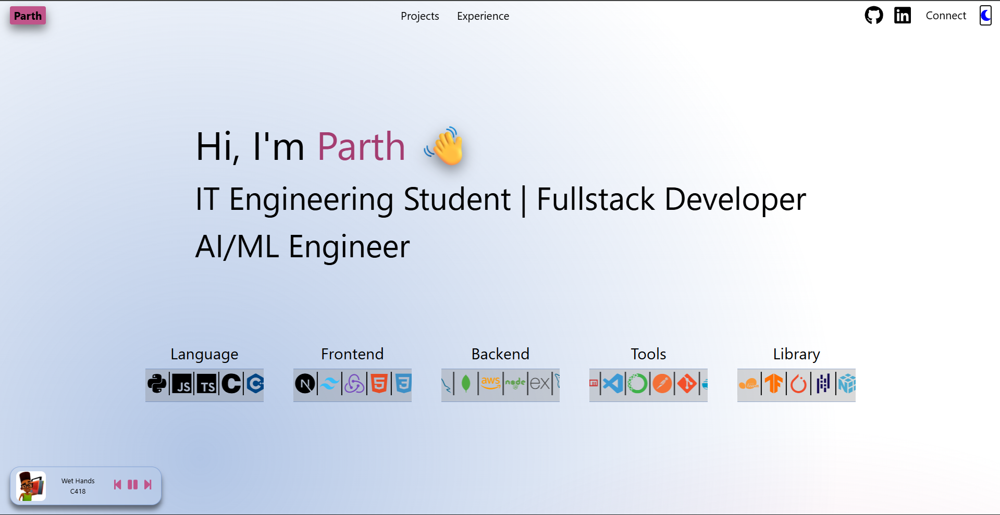
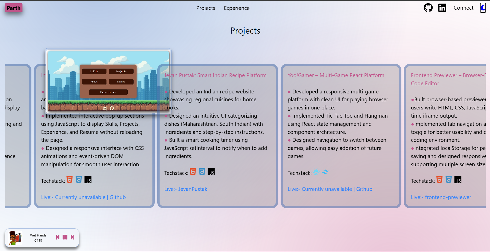
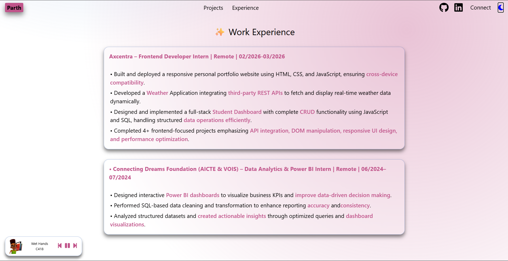

💼 Personal Portfolio – Parth

Hi, I'm Parth 👋
IT Engineering Student | Full-Stack Developer | AI/ML Engineer

This repository contains the source code for my personal developer portfolio website showcasing my projects, skills, and work experience.

🔗 Live Portfolio: https://topperguy.netlify.app/

🚀 Features

<ul>
<li>Responsive portfolio website</li>
<li>Interactive project showcase</li>
<li>Work experience section</li>
<li>Tech stack display</li>
<li>Smooth UI animations</li>
<li>Clean and modern UI design</li>
<li>Mobile-friendly layout</li>
</ul>

## 🖼️ Preview

🛠️ Tech Stack
<ul>
  <li>React</li>
  <li>Tailwindcss</li>
  <li>CSS Animations</li>
</ul>

👨‍💻 Author

-Me
